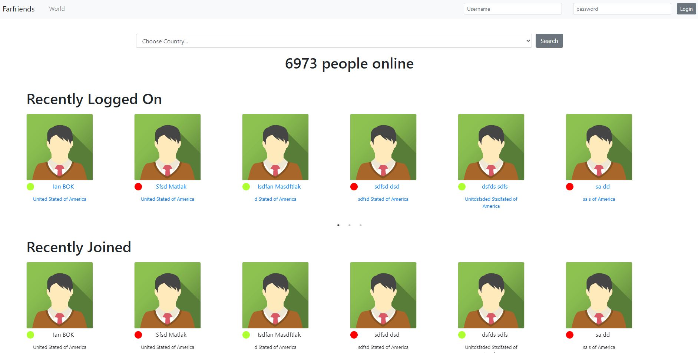
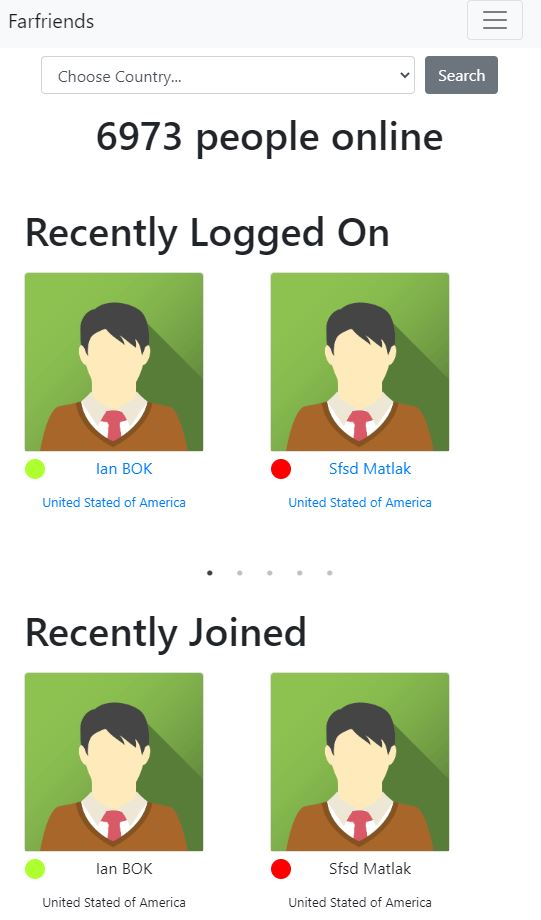
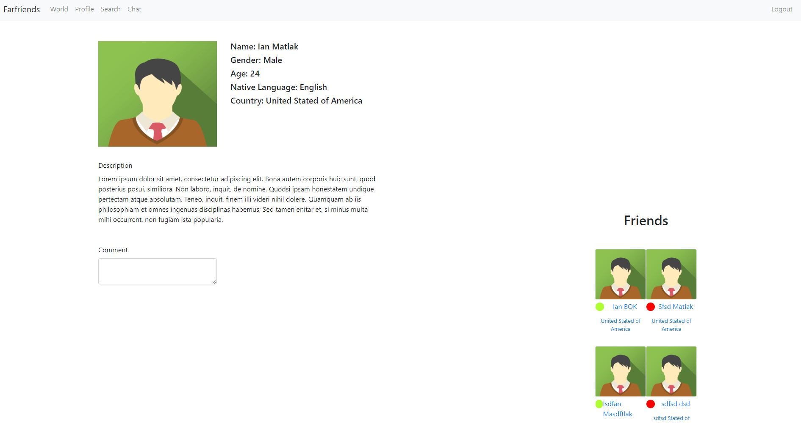
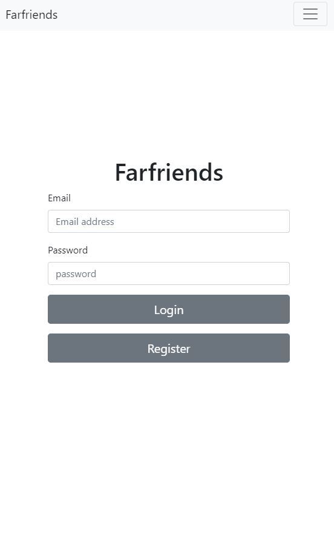
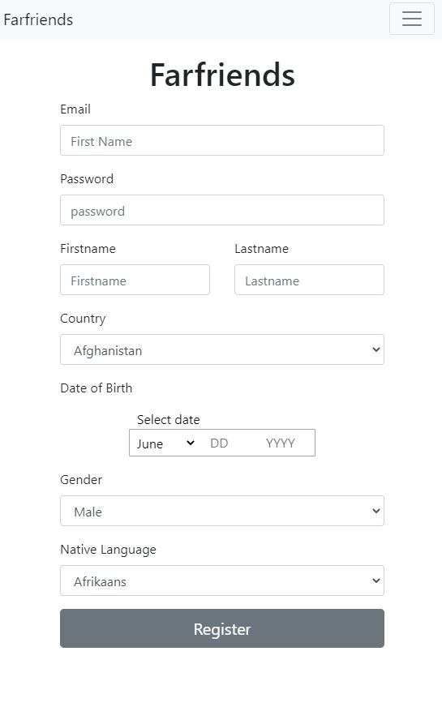

# Hack Northeast Interfriends

## The Inspiration

The world's a very isolated place now as of the outbreak of COVID-19. Inter-Friends aims to connect people across the world, because _we're all in this together_.

## The Project

We've created an application where users from around the world can connect with each other and keep socializing throughout this rough time. On the front page you can see the most recent users online and new users who just registered. Once signed up you can view each other's profile to find the best Inter-Friend for this pandemic.

## UI v1

Logo

Landing page

Profile page

Login

Register

## The Building

- Backend hosting using Heroku
- Backend using Node & Express [Josh](https://github.com/J-Obog)
- Frontend using React + Global State [Ian](https://github.com/mnai01)

## The Difficulties

This project has led to some mind-numbingly frustrating experiences which at the end of the day was actually a small fix. In addition to that, some of our teammates dropped out leaving only the two of us. This unexpected dropout caused us to change languages/frameworks for the backend mid-project. No hard feelings.

## The Accomplishments

This was a large, ambitious project for us to complete. Perhaps too large, but what we did get done is an achievement in and of itself!

## The Lessons

- Global State Management within React
- Authentication using Node
- Password Encryption using bcrypt
- Never try to build a social media app with 2 people in 36hours

## The Future

We have many plans for the future of this project, including adding the ability to actually send messages to other users. We have prepared database tables to create this functionality, but still, need to do more.
